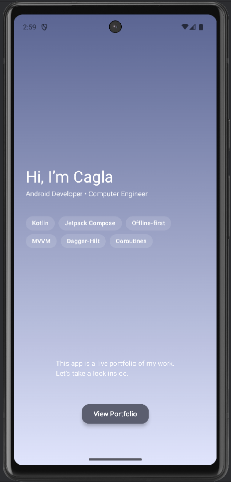
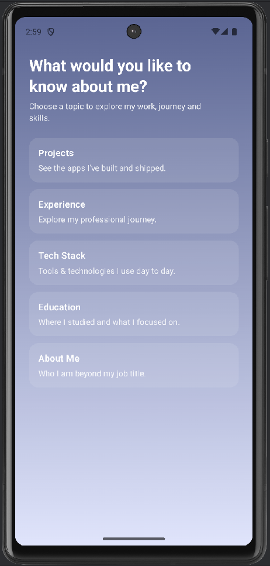

# MyPortfolioApp

MyPortfolioApp is a modern Android portfolio application built with **Jetpack Compose** and **Clean Architecture**.  
It showcases my skills, experience, education, tech stack, and selected projects inside a clean, smooth and mobile-friendly UI.

This app acts as a *personal interactive CV* — ideal for recruiters, companies, or collaborators who want to quickly learn about my Android development background.

---

## Features

- **Intro screen** with personal branding  
- **Home layout** with tab navigation  
- **Projects** section  
- **Education** section  
- **Experience timeline**  
- **Tech Stack**  
- **About Me**  
- Compose-first, minimal UI  
- Extremely lightweight and fast  

---

## Tech Stack

| Category | Technologies |
|---------|--------------|
| **Language** | Kotlin |
| **UI** | Jetpack Compose, Material3 |
| **Architecture** | Clean Architecture (Presentation / Domain / Data) |
| **State Management** | ViewModel, StateFlow |
| **DI** | Hilt |
| **Navigation** | Navigation Compose |
| **Async** | Coroutines, Flow |
| **Build System** | Gradle (KTS) |

---

  
  

## How to Run

1. Clone this project or just download the zip file.
2. Open the project in Android Studio.
3. Install the necessary dependencies.
4. Run the project on an emulator or real device.
